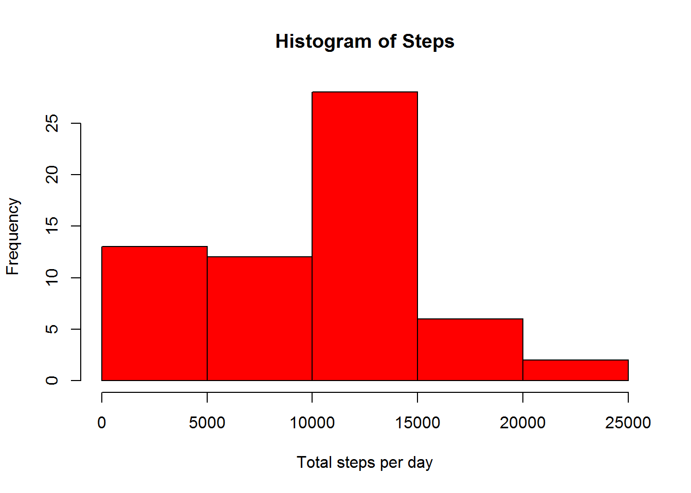
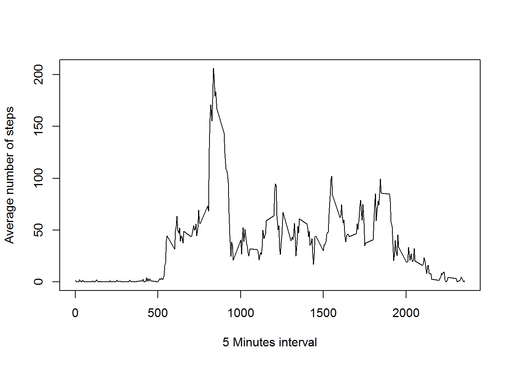
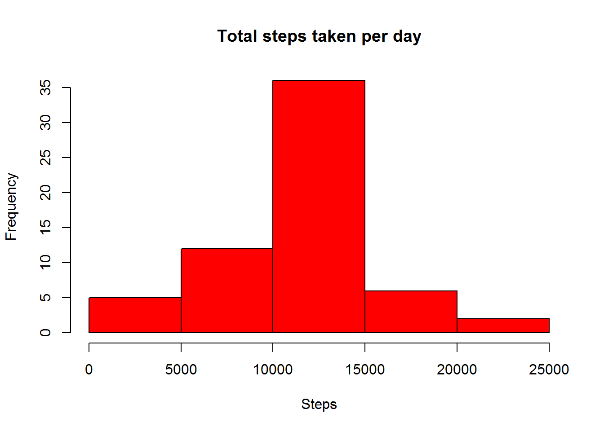
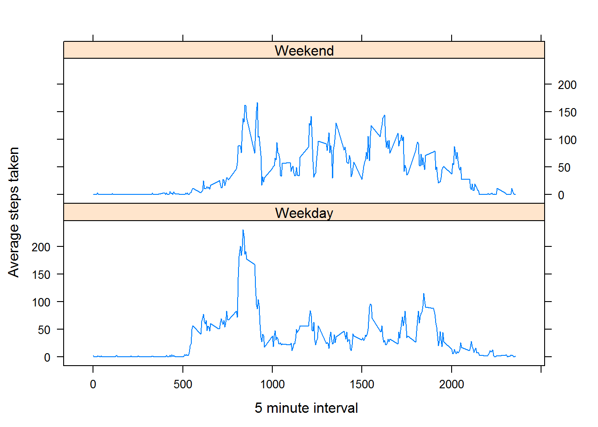

# Reproducible Research Assignment 1
Sudhir  
April 25, 2016  


## Loading the data


```r
setwd("C:/Users/Sugrutha/Documents/Appa/RProjects/Repoducable Research")
df <- read.csv("activity.csv", colClasses = c("numeric","Date","integer"))
str(df)
```

```
## 'data.frame':	17568 obs. of  3 variables:
##  $ steps   : num  NA NA NA NA NA NA NA NA NA NA ...
##  $ date    : Date, format: "2012-10-01" "2012-10-01" ...
##  $ interval: int  0 5 10 15 20 25 30 35 40 45 ...
```

## What is mean total number of steps taken per day?

1] Calculate the total number of steps taken per day
2] Make a histogram of the total number of steps taken each day


```r
dSteps <-  aggregate(list(Steps = df$steps), by=list(date=df$date), FUN=sum, na.rm=TRUE)
head(dSteps)
```

```
##         date Steps
## 1 2012-10-01     0
## 2 2012-10-02   126
## 3 2012-10-03 11352
## 4 2012-10-04 12116
## 5 2012-10-05 13294
## 6 2012-10-06 15420
```

```r
hist(dSteps$Steps, main="Histogram of Steps", col="red", xlab="Total steps per day")
```




3] Calculate and report the mean and median of the total number of steps taken per day


```r
sMean  <- mean(dSteps$Steps);
sMean;
```

```
## [1] 9354.23
```

```r
sMedian <- median(dSteps$Steps);
sMedian;
```

```
## [1] 10395
```

## What is the average daily activity pattern?

Make a time series plot (i.e. type = "l") of the 5-minute interval (x-axis) and the average number of steps taken, averaged across all days (y-axis)


```r
meanStepsPerIntval <- aggregate(df$steps ~ interval, df, FUN = "mean", na.rm = TRUE)

plot(meanStepsPerIntval, type="l", xlab="5 Minutes interval", ylab="Average number of steps")
```



Which 5-minute interval, on average across all the days in the dataset, contains the maximum number of steps?


```r
maxNumOfSteps <- max(meanStepsPerIntval$`df$steps`)
maxNumOfSteps
```

```
## [1] 206.1698
```

```r
meanStepsPerIntval[meanStepsPerIntval$`df$steps` == maxNumOfSteps,]
```

```
##     interval df$steps
## 104      835 206.1698
```

## Imputing missing values

Calculate and report the total number of missing values in the dataset (i.e. the total number of rows with NAs)


```r
sum(is.na(df$steps))
```

```
## [1] 2304
```

Devise a strategy for filling in all of the missing values in the dataset
(using the mean for that 5-minute interval)
 
 Add a new colunn to original dataset "FullSteps"


```r
df$FullSteps <- df$steps
head(df)
```

```
##   steps       date interval FullSteps
## 1    NA 2012-10-01        0        NA
## 2    NA 2012-10-01        5        NA
## 3    NA 2012-10-01       10        NA
## 4    NA 2012-10-01       15        NA
## 5    NA 2012-10-01       20        NA
## 6    NA 2012-10-01       25        NA
```


loop thru all rows and replace NA with


```r
for (i in 1:nrow(df) ) {
  ## if steps is NA replace step value of 5-minute interval mean
  if (is.na(df$steps[i])) {
      intvalIndex <- which(meanStepsPerIntval$interval == df$interval[i]);
      df$FullSteps[i] <- meanStepsPerIntval$`df$steps`[intvalIndex];
  }
}
```


Create a new dataset with all he missing data filled in.


```r
newDf <- df[, c(2,3, 4) ]
head(newDf)
```

```
##         date interval FullSteps
## 1 2012-10-01        0 1.7169811
## 2 2012-10-01        5 0.3396226
## 3 2012-10-01       10 0.1320755
## 4 2012-10-01       15 0.1509434
## 5 2012-10-01       20 0.0754717
## 6 2012-10-01       25 2.0943396
```

Make a histogram of the total number of steps taken each day 


```r
TotalStepsTakenPDay <- aggregate( FullSteps ~ date, newDf, FUN = "sum" )
hist(TotalStepsTakenPDay$FullSteps, col="red",xlab="Steps", main="Total steps taken per day")
```



Calculate and report the mean and median total number of steps taken per day.


```r
eMean <- mean(TotalStepsTakenPDay$FullSteps);
eMean;
```

```
## [1] 10766.19
```

```r
eMedian <- median(TotalStepsTakenPDay$FullSteps);
eMedian;
```

```
## [1] 10766.19
```

```r
#head(newDf)
```
Do these values differ from the estimates from the first part of the assignment? 
What is the impact of imputing missing data on the estimates of the total daily number of steps?
Yes, they do differ.


```r
impactOnMean <- (eMean/sMean)*100 - 100;
impactOnMedian <- (eMedian/sMedian)*100 - 100;
```
Mean has increased by 15.0943396 percent, and Median has increased by 3.5708387 percentage.

## Are there differences in activity patterns between weekdays and weekends?

Adding a new column with day of the week


```r
newDf$day <- weekdays(newDf$date)
head(newDf)
```

```
##         date interval FullSteps    day
## 1 2012-10-01        0 1.7169811 Monday
## 2 2012-10-01        5 0.3396226 Monday
## 3 2012-10-01       10 0.1320755 Monday
## 4 2012-10-01       15 0.1509434 Monday
## 5 2012-10-01       20 0.0754717 Monday
## 6 2012-10-01       25 2.0943396 Monday
```

Adding a new column to indicate if weekend or weekday


```r
factWkDay <- c("Saturday","Sunday")
newDf$week <- ifelse ( newDf$day %in%  factWkDay, "Weekend", "Weekday" )
newDf$week <- as.factor(newDf$week )
head(newDf)
```

```
##         date interval FullSteps    day    week
## 1 2012-10-01        0 1.7169811 Monday Weekday
## 2 2012-10-01        5 0.3396226 Monday Weekday
## 3 2012-10-01       10 0.1320755 Monday Weekday
## 4 2012-10-01       15 0.1509434 Monday Weekday
## 5 2012-10-01       20 0.0754717 Monday Weekday
## 6 2012-10-01       25 2.0943396 Monday Weekday
```

```r
meanStepsPerIntvlByWeek <- aggregate(newDf$FullSteps, by = list(newDf$week, newDf$interval), mean )
head(meanStepsPerIntvlByWeek)
```

```
##   Group.1 Group.2          x
## 1 Weekday       0 2.25115304
## 2 Weekend       0 0.21462264
## 3 Weekday       5 0.44528302
## 4 Weekend       5 0.04245283
## 5 Weekday      10 0.17316562
## 6 Weekend      10 0.01650943
```

```r
#Set column names
names(meanStepsPerIntvlByWeek) <- c("week","interval","steps")
head(meanStepsPerIntvlByWeek)
```

```
##      week interval      steps
## 1 Weekday        0 2.25115304
## 2 Weekend        0 0.21462264
## 3 Weekday        5 0.44528302
## 4 Weekend        5 0.04245283
## 5 Weekday       10 0.17316562
## 6 Weekend       10 0.01650943
```

Plot the average steps taken on Week days and on Weekends separately

```r
library(lattice)

xyplot(meanStepsPerIntvlByWeek$steps ~ meanStepsPerIntvlByWeek$interval| meanStepsPerIntvlByWeek$week, layout=c(1,2) ,  type="l", xlab=" 5 minute interval", ylab="Average steps taken" )
```


